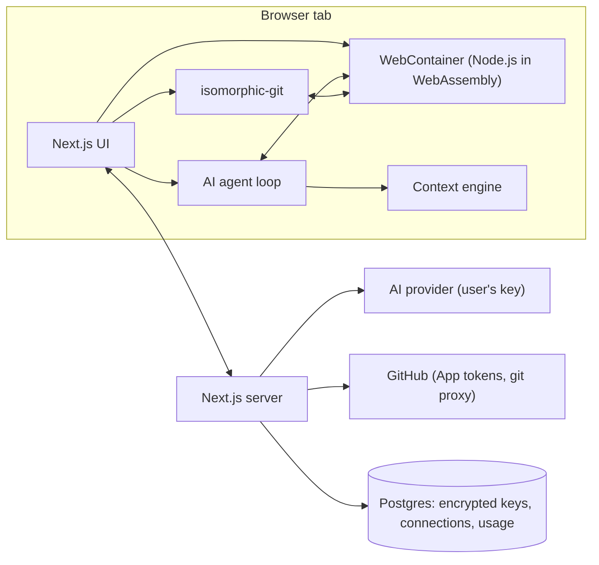

# CodeClik — Product Requirements Document

> A dev machine that lives in a browser tab: editor, shell, Git, GitHub and an AI agent that builds, runs and checks your app. No install, no Docker, no `ssh`, just a URL.

| | |
|---|---|
| **Product** | CodeClik |
| **Owner** | Niket Anand |
| **Status** | Built, preparing first deployment (Render) |
| **Last updated** | 4 October 2026 |
| **Demo** | https://youtu.be/bMfBgjZ88FA |

This document describes **what** CodeClik is, **why** each part was built the way it was, and the decisions, limits and lessons along the way. It is about the concepts, not the code.

---

## Contents

1. [Problem and vision](#1-problem-and-vision)
2. [Target users](#2-target-users)
3. [Goals and non-goals](#3-goals-and-non-goals)
4. [Original scope vs. what shipped](#4-original-scope-vs-what-shipped)
5. [Core architecture](#5-core-architecture)
6. [The workspace (runtime)](#6-the-workspace-runtime)
7. [Editor, Explorer, Search, Terminal, Preview](#7-editor-explorer-search-terminal-preview)
8. [AI assistant](#8-ai-assistant)
9. [AI agent](#9-ai-agent)
10. [Rate limits and usage tracking](#10-rate-limits-and-usage-tracking)
11. [Git (Source Control)](#11-git-source-control)
12. [GitHub integration](#12-github-integration)
13. [Security](#13-security)
14. [Data model](#14-data-model)
15. [UI and design decisions](#15-ui-and-design-decisions)
16. [Deployment](#16-deployment)
17. [Known issues and lessons learned](#17-known-issues-and-lessons-learned)
18. [Roadmap](#18-roadmap)

---

## 1. Problem and vision

**The problem.** Starting to code still means setup: installing Node, an editor, Git, configuring keys, and often a cloud dev box that costs money per hour. For beginners, students and quick experiments, setup is the biggest blocker. Cloud IDEs solve it by running your code on *their* servers, which is expensive to operate and slow to start.

**The vision.** Open a tab, and within seconds you have a real Node.js environment (file system, package manager, interactive shell) running **entirely inside the browser**. Ask an AI agent to *"build a restaurant billing app"*, and it writes the files, installs packages, starts the dev server, reads the errors from the live preview and fixes them, asking before it runs anything. Then commit and push to GitHub without leaving the tab.

**The key idea.** User code never runs on our server. The browser is the computer. The server only does the few things a browser can't do safely on its own.

---

## 2. Target users

| User | What they need |
|---|---|
| **Students and beginners** | Code without installing anything; an AI that explains and builds |
| **Developers prototyping** | Spin up a React/Vite/Node idea in seconds, then push it to GitHub |
| **People on locked-down machines** | School or work laptops where installing tools isn't allowed |
| **AI-first builders** | Describe an app, let an agent build and debug it, and keep full control |

---

## 3. Goals and non-goals

**Goals**
- A real, interactive Node.js environment in the browser, with no server-side code execution.
- A VS Code-like experience: editor, explorer, search, terminal, Git.
- An AI agent that can actually *build and verify* apps, not just chat.
- **Bring your own model:** users plug in their own AI key, from any of many providers.
- Safe by default: approvals for risky agent actions, encrypted keys, no SSRF.

**Non-goals (for now)**
- Running non-JavaScript languages (Python, Java, Go…). They can be edited, not run.
- Server-side hosting of users' apps.
- Real-time multi-user collaboration.
- Persisting workspaces across page reloads (on the roadmap).

---

## 4. Original scope vs. what shipped

The project started from a short requirements list. This is how it evolved:

| Original requirement | Outcome |
|---|---|
| Authentication: login, signup, logout, profile | ✅ Clerk sign-in; the editor and every API route require it |
| Dashboard: create/recent/rename/delete/search/star projects | 🔄 **Dropped for now.** The dashboard was removed; `/dashboard` redirects straight to the editor. Workspaces live in memory, so a project list had nothing to list yet |
| Playground: terminal, preview, explorer, tabs, file operations | ✅ Shipped, then expanded (search, drag & drop, context menu, command palette) |
| Templates: React, Angular, Vue | 🔄 Template names exist, but no starter files are generated yet; the agent writes projects from scratch |
| Profile: user details | 🔄 Via Clerk; the settings page is a placeholder |
| AI assistant: chat, review code, read file, debug | ✅ Shipped, and grew into a full tool-using **agent** |
| GitHub: connect | ✅ Shipped as a GitHub App with verified ownership, clone, pull, push, force push |
| Deploy: Vercel | 🔄 **Changed to Render** after comparing platforms (see [§16](#16-deployment)) |

---

## 5. Core architecture

**Principle: a thin server.** Files, the shell, the dev server and Git all run in the browser. The server only:
1. checks sign-in (Clerk);
2. decrypts the user's AI key for **one outbound call** and streams the answer back;
3. mints short-lived GitHub tokens;
4. proxies Git traffic (browsers can't call github.com directly because of CORS).

**Why this matters:** near-zero compute cost per user, instant start, and user code never runs on our infrastructure.

**Tech choices**

| Layer | Choice | Why |
|---|---|---|
| Framework | Next.js 16 (App Router), React 19, TypeScript | One codebase for UI and API routes |
| Runtime | WebContainers (`@webcontainer/api`) | Real Node.js + npm in the browser |
| Editor | Monaco | The VS Code editor itself |
| Terminal | xterm.js | Standard web terminal |
| Git | isomorphic-git | Pure-JS Git that works on a virtual file system |
| Auth | Clerk | Drop-in auth with middleware for every route |
| Database | PostgreSQL + Prisma | Only stores connections, keys and usage |
| Styling | Tailwind CSS v4, lucide icons | |

---

## 6. The workspace (runtime)

- **One WebContainer per tab.** The browser can only boot one, so it's created once and reused (it even survives hot reloads during development).
- **Cross-origin isolation is required.** WebContainers need `SharedArrayBuffer`, which browsers only allow when the page sends strict headers (`Cross-Origin-Opener-Policy: same-origin`, `Cross-Origin-Embedder-Policy: require-corp`). The app sends these on every route.
- **npm registry workaround.** Inside WebContainers, npm's `https` registry requests fail with *"Protocol https: not supported"*, while `http` works. On every boot the npm registry is set to `http://registry.npmjs.org/` before anything can run `npm install`.
- **What can run:** HTML/CSS/JS, TypeScript, React, Vite, Next.js, Node/Express, npm packages. When a project contains other languages (Python, Java, C++, Go, Rust…), a **support notice** explains they can be edited but not run.
- **The workspace lives in memory.** Refreshing or closing the tab clears it, so users are told to push to GitHub.
- **Browser support:** best in Chrome/Edge. Safari's support for the required isolation is only partial, which can cause broken or half-loaded previews.

---

## 7. Editor, Explorer, Search, Terminal, Preview

### 7.1 Editor
- Monaco with tabs, unsaved-change dots, ⌘S to save, and a **save-before-close** dialog.
- **Diff views:** any commit's file changes, plus VS Code-style *Working Tree* / *Index* diffs from Source Control.
- **Jump to line:** opening a search result selects the match and scrolls to it.

### 7.2 File Explorer
- Inline **New File / New Folder / Rename** rows in the tree, with no pop-ups.
- `node_modules` and `.git` are hidden from the tree.
- **Drag & drop:**
  - drop on a folder to move into it; drop on a file to move into that file's folder; drop on *WORKSPACE* or empty space to move to the top level;
  - hold **⌥ Option** while dropping to copy;
  - the target folder is highlighted, and a closed folder opens after ~600 ms of hovering;
  - files dragged in from the computer are **uploaded** (single files; dropped folders aren't supported yet).
- **Right-click menu (VS Code style):** New File, New Folder, Cut (⌘X), Copy (⌘C), Paste (⌘V), Duplicate, Copy Path (⌥⌘C), Copy Relative Path (⇧⌥⌘C), Rename (F2), Delete (⌘⌫).
- **Safety rules:**
  - a folder can't be moved or copied into itself;
  - an existing name asks before replacing;
  - copying into the same folder creates *"name copy"*, then *"name copy 2"*;
  - open tabs follow a moved file; a cut item appears dimmed until pasted.

### 7.3 Search (⌘⇧F)
- Results update as you type (250 ms debounce), grouped by file with match counts and highlighted matches.
- **Toggles:** Match Case, Whole Word, Regex (an invalid regex shows a red error).
- **Replace:** replace all (⌘↵), replace in one file, or replace one match, with a crossed-out/green preview. Regex replace supports `$1` groups.
- **Files to include / exclude** with glob patterns. A pattern without a slash matches at any depth, as in VS Code.
- **Skipped:** `node_modules`, `.git`, `.next`, `dist`, `build`, `coverage`, binary files (images, fonts, media) and files over 1 MB. Results stop at 2,000 matches.
- **Open files:** search reads the editor's unsaved text. Replacing in an open file edits the tab (left unsaved, like VS Code); files that aren't open are written to disk.
- Matching is line by line, so a single match can't span two lines.

### 7.4 Terminal
- An interactive shell (`jsh`) inside the WebContainer.
- **The shell is kept alive** when the panel closes, so a running dev server isn't killed.
- *Known issue:* reopening the panel creates a fresh, empty screen, which hides the prompt and any running program's output (see [§17](#17-known-issues-and-lessons-learned)).
- Ctrl+C stops a program. Ctrl+Z (suspend) doesn't exist in this shell and just prints `^Z`.

### 7.5 Live Preview
- Opens automatically when a dev server starts (the WebContainer `server-ready` event).
- Reload and open-in-new-tab buttons.
- **Preview errors are forwarded**: uncaught errors and `console.error` from the preview page are captured, so the agent can see runtime bugs.

### 7.6 Command palette (⌘K)
Jump to any file or panel without the mouse.

---

## 8. AI assistant

### 8.1 Bring your own model
Users connect **their own** provider key. Supported providers:

| Provider | Notes |
|---|---|
| Grok / xAI | |
| Groq | Fast inference; not the same company as xAI's Grok |
| OpenAI | |
| Anthropic / Claude | Chat only (its API format differs) |
| Google Gemini | Chat only |
| OpenRouter | One key, many models |
| AWS Bedrock | OpenAI-compatible endpoint; the user picks a **region** and an **endpoint type** (*runtime* or *mantle*); the app lists the models that key can use |
| Custom (OpenAI-compatible) | Any compatible URL |
| Ollama / Local | Local models; **development only** |

- **Chat** works with all providers. **Agent mode** (tool calling) works with the OpenAI-compatible ones: xAI, Groq, OpenAI, OpenRouter, Bedrock, Custom, Ollama/Local.
- Several providers can be saved, and switched from the panel header.

### 8.2 How a chat request flows
1. The browser sends the provider, model and messages to `/api/ai/chat`.
2. The server checks sign-in, applies rate limits, loads the user's saved connection and **decrypts the key on the server only**.
3. It calls the provider and **streams** the answer back.
4. **One stream format for the UI.** Anthropic, Gemini and Ollama answer in different shapes, so the server translates their streams into the OpenAI format; the UI only understands one format.

**Reliability rules for the outbound call**
- **Timeout:** 60 seconds per request.
- **Retries:** up to 3 attempts on 408/429/500/502/503/504, honouring `Retry-After`, otherwise backing off 1 s → 2 s → 4 s (max 8 s).
- **No redirects:** redirects are never followed, so a provider URL can't bounce the server to an internal address.
- **OpenRouter reply cap:** replies are capped at **16,000 tokens**. Without a cap, OpenRouter reserves credit for the model's maximum reply (often 128k tokens) and refuses with *"out of credits"* even when real replies are small.
- **Friendly errors:**
  - 401/403 → *"key is invalid or expired"*;
  - 402 → *"out of credits"*;
  - 429 → *"rate limit hit"*.

  The upstream status code isn't returned, because for a user-supplied endpoint it could reveal what's running there.

### 8.3 Hiding model "thinking"
Some models (e.g. `gpt-oss` on Bedrock, DeepSeek-R1) put their chain of thought **inline** in the reply as `<reasoning>…</reasoning>` or `<think>…</think>`. Users only want the answer, so the server strips such a block **only when it appears at the very start of the reply**. This works even when a tag is split across stream chunks, and leaves tags inside real answers (code, explanations) alone. It applies to the OpenAI-compatible providers and Ollama.

### 8.4 Context modes
What code the AI sees with each question:

| Mode | Sends |
|---|---|
| Current file | The open file |
| Selected code | The editor selection |
| Open files | All open tabs |
| Entire workspace | Code picked by the **context engine** |

Plain context is capped at ~12,000 characters / 25 files.

### 8.5 Context engine
A built-in code-intelligence package:
1. **Parses** the project with tree-sitter into symbols (functions, classes…) and imports.
2. **Builds a code graph** of which files import which.
3. **Retrieves** relevant code with three methods: symbol match, graph neighbours of the open file, and plain text search.
4. **Scores, merges and trims** the results to a token budget (default 8,000 tokens).
5. **Stays fresh:** a file watcher updates the index as you edit, so there's no full re-scan per message.

It ignores `.git`, `node_modules`, `.next`, `dist`, `build` and `coverage`.

---

## 9. AI agent

The agent turns the assistant from "answers questions" into "builds and verifies apps".

### 9.1 Tools

| Tool | Purpose | Needs approval |
|---|---|---|
| `read_file` | Read a file | No |
| `list_directory` | List folders | No |
| `write_file` | Create or overwrite a file (whole content) | No |
| `create_directory` | Make a folder | No |
| `delete_file` | Delete | **Yes** |
| `run_command` | Run a program that finishes (install, build, test) | **Yes** |
| `start_dev_server` | Start a long-running server | **Yes** |
| `check_dev_server` | Read server logs and preview errors | No |

**Why these approvals:** reading and writing are easy to review and undo (the editor shows diffs). Deleting files and running code are the two genuinely hard-to-reverse actions, so a human clicks **Allow** in the chat first.

### 9.2 Guardrails
- **Protected paths:** `.git`, `node_modules` and `.env*` can never be touched, and paths can't escape the project root.
- **Size limits:** reads are capped at ~200 KB, command output at 20,000 characters, and commands at **60 seconds**.
- **Commands that can't work** in a browser runtime (`bash`, `grep`, `python`, pipes, `&&`…) are rejected up front, with the right alternative suggested.
- **Generators** (`npm create vite`, `create-react-app`) are forbidden because they ask interactive questions and hang.

### 9.3 The loop

| Rule | Value | Why |
|---|---|---|
| Max steps per run | **200** | Big multi-file builds finish in one run |
| Stuck detection | Same failing call **3 times** in a row → stop | Catches runaway loops |
| 429 retries per model turn | **5**, honouring `Retry-After` (default 10 s) | Survive provider rate limits mid-task |
| Context compaction | Last **12** messages in full; older tool output trimmed to **1,500** chars | Long runs stay inside the model's context window |
| Stop button | Aborts before the next model turn or tool call | User stays in control |

### 9.4 Dev server management
- **One dev server at a time:** starting a new one stops the old.
- **Waits up to 90 s** for the server to be ready. A slow first compile is left running, so it can be checked later.
- **Keeps logs** (last 20,000 chars, colour codes removed) and the **last 50 preview errors**, so `check_dev_server` can see compile errors *and* runtime errors in the page.

### 9.5 The agent's instructions (system prompt), key rules
- **Environment:** it's a WebContainer, so only node, npm and npx exist; there's no bash, git, python, pipes or databases. Use in-memory data, JSON or localStorage; prefer pure-JS packages (`bcryptjs` over `bcrypt`).
- **Reading and writing:** read before changing; make the smallest change; always write complete files, never "rest unchanged" placeholders.
- **Installs and commands:** do all installs in one `npm install`; use non-interactive flags; run tests once, not in watch mode.
- **Vite projects:** `index.html` goes in the **project root** (never `public/`), buttons use `type="button"` and never reload the page, and localStorage data falls back to defaults. This rule was added after real failures (see [§17](#17-known-issues-and-lessons-learned)).
- **Before finishing:** verify (build, test, `check_dev_server`), fix, and check again. Finish with a short summary, because the user only sees the summary, not the tool calls.

### 9.6 What the user sees
A collapsible *"Worked for 42s · 9 steps"* log, then the answer. Approval cards appear inline when the agent needs permission.

---

## 10. Rate limits and usage tracking

**Why:** AI calls go through our server. Without limits, one user (or a bug) could hog the server or burn through a provider's rate limit.

| Limit | Value |
|---|---|
| Requests per user | **30 per minute** (sliding 60 s window) |
| Concurrent requests per user | **2** |
| Concurrent requests overall | **8** |
| Waiting queue (overall) | **32**; beyond that → *"queue is busy, try again shortly"* |

- **Over the limit:** the user gets a clear message and a `Retry-After` time (HTTP 429).
- **Queueing:** a request that can't start yet waits in a fair queue rather than failing.
- **Slot release:** a slot is freed when the stream finishes, fails or is cancelled by the user.
- **Where state lives:** in **server memory**. This is accurate on a single always-on server (Render), but would only be approximate on serverless platforms where each instance counts separately.

**Usage tracking:** every AI request is recorded (user, provider, model, status *started → completed / failed*, duration) for monitoring and future billing. It never stores prompts or answers.

---

## 11. Git (Source Control)

Full local Git in the browser via isomorphic-git, with a VS Code-style panel: stage/unstage (single or all), commit (⌘↵), branches (create/switch/delete), merge, tags, remotes, fetch/pull/push, history with per-commit diffs, discard changes, and a change-count badge on the Source Control icon.

### Key decisions
- **Built-in ignores.** `node_modules/`, `dist/`, `build/`, `.next/`, `.vite/`, `.turbo/`, `.cache/`, `coverage/`, `*.log`, `.DS_Store` and `.env*` are written to `.git/info/exclude`, Git's local-only ignore file. Every repo (new, cloned or agent-built) skips them, even without a `.gitignore`, and ignored folders aren't even scanned.
- **Default `.gitignore`.** New repos get a standard one, so the rules travel with the project. An existing one is never overwritten.
- **Self-healing repo.** If an earlier init was interrupted before `HEAD` was written, it's repaired on every read, instead of crashing the first commit.
- **No repo, no file list.** Without a `.git` folder, Source Control shows **Initialize Repository / Clone Repository** instead of listing files (see the lesson in [§17](#17-known-issues-and-lessons-learned)).
- **Fast clones.** Only the latest commit of one branch is downloaded (shallow, depth 1). Full history in pure-JS Git took minutes and looked stuck.
- **Push as New Project.** A shallow clone can't be pushed to a *different* repo, so this action replaces the history with one fresh commit.
- **Force Push** is available for overwriting a remote branch.
- **Merge:** requires a clean working tree, like VS Code. On conflicts nothing is changed and the user gets a clear message, because isomorphic-git can't pause mid-merge.
- **Commit author:** the signed-in user's name and email from Clerk (fallback: *CodeClik User / noreply@codeclik.dev*). Earlier this was hardcoded, which would have signed every user's commits with one name.
- **Remotes made beginner-friendly:**
  - the first remote is named `origin` automatically, so users only paste a GitHub link;
  - a name box appears only when adding a second remote;
  - links pasted without `https://` are accepted;
  - `origin` shows a *"default"* label.

---

## 12. GitHub integration

**Why a GitHub App (not personal tokens):** users grant access to chosen repositories only, and the server mints **short-lived installation tokens** per operation instead of storing a long-lived password-like token.

**Connect flow**
1. *Connect GitHub* opens the app installation on GitHub (in a new tab), with a **state cookie** to prevent forged callbacks.
2. GitHub returns an installation ID **and** an OAuth sign-in code.
3. The server exchanges the code, then calls GitHub's `/user/installations` to **verify the signed-in GitHub user actually owns that installation**.
4. Only then is the connection saved.

**Why step 3 exists:** the original flow trusted the installation ID from the URL, so a user could type someone else's ID and get tokens for *their* repositories. The ownership check closes that hole.

**Git proxy:** browsers can't talk to github.com directly (CORS), so Git traffic goes through our own proxy route. The free public isomorphic-git proxy was too slow and rate-limited for real repos. The proxy:
- requires sign-in;
- only targets **github.com, gitlab.com, bitbucket.org**;
- only forwards real Git protocol requests (info/refs, upload-pack, receive-pack), nothing else.

**Clone:** by URL (public repos) or from the user's connected repositories.

---

## 13. Security

| Area | Measure |
|---|---|
| Authentication | Clerk middleware on every page and API route; the editor requires sign-in; users only see their own data |
| AI keys | **AES-256-GCM** encrypted at rest (random IV, auth tag); decrypted only on the server for one call; never sent back to the browser. The encryption key must be backed up, because losing it makes every saved key unreadable |
| SSRF | User-supplied AI endpoints must be public `https`. Localhost, private networks, carrier-grade NAT, link-local and cloud metadata (`169.254.169.254`), multicast and IPv4-mapped IPv6 tricks are blocked. Checked when saving **and** before each call; redirects aren't followed. Ollama/local is allowed only in development. *Known gap:* DNS rebinding between the check and the call |
| GitHub | Ownership-verified installations, state cookie, short-lived tokens |
| Git proxy | Signed-in only, host allowlist, protocol-only forwarding |
| Agent | Approvals, protected paths, no root escape, size and time limits |
| Error messages | Provider status codes aren't echoed for user endpoints |

---

## 14. Data model

The database is deliberately small; projects live in the browser.

| Table | Stores |
|---|---|
| **GitHubConnection** | Clerk user ↔ GitHub installation ID (one each, unique) |
| **AIProviderConnection** | Per user and provider: model, **encrypted** API key, optional endpoint |
| **AIUsageEvent** | Per AI request: user, provider, model, status, duration, time (indexed by user and by provider) |

---

## 15. UI and design decisions

- **Theme:** dark, VS Code-inspired (near-black panels, subtle grey borders), white for emphasis, and a light status bar.
- **Brand:** the CodeClik logo is a code bracket next to a cursor ("code" + "click").
- **AI panel cleanup:**
  - the purple sparkle and the *"CODECLIK AI"* title were removed; the **provider/model switcher** now sits in the panel header;
  - the empty chat shows only *"Ask CodeClik AI anything"* plus suggestions;
  - the top-bar **AI button** shows a small CodeClik logo instead of a Gemini-style sparkle.
- **Chat vs. Agent toggle:** two header icons (bot = Agent, speech bubble = Chat). The selected one is a **white box with a black icon and border**, so the current mode is obvious at a glance. Agent is greyed out for providers without tool calling.
- **Feel like VS Code:** an activity bar with Explorer, Search, Source Control and Extensions; a change badge; the command palette; keyboard shortcuts throughout.
- **Beginner-friendly wording:** e.g. *"Not connected yet. Paste your GitHub repository link below — that's where Push sends your code."*

---

## 16. Deployment

### 16.1 Platform comparison

| | **Vercel** | **Railway** | **Render** | **Cloudflare** |
|---|---|---|---|---|
| AWS analogy | Lambda | ECS / EC2 | ECS / EC2 | Lambda@Edge |
| Model | Starts per request, then stops | Always-on server | Always-on server | Tiny functions worldwide |
| Time limit | Yes, per function | None | None | CPU-time limit |
| Request size | ~4.5 MB cap | No such cap | No such cap | Limited |
| Changes needed | Minimal | Minimal | Minimal | Most (adapter, Prisma changes, not full Node.js) |

**Concept: "function time limit".** Serverless platforms (Vercel, like AWS Lambda) start a short-lived copy of your code per request and kill it after a set time. CodeClik streams long AI answers and agent runs for minutes, which a time limit would cut off mid-answer. An always-on server (like EC2) has no such limit.

### 16.2 Decision: Render
An always-on Node server fits CodeClik best:
- no time limits on long AI streams;
- no 4.5 MB cap, so big Git pushes work;
- the in-memory rate limiter is accurate (one server, one count);
- managed Postgres on the same platform.

Use a **paid plan**: the free plan sleeps after 15 minutes idle, and the next visit takes ~30–60 s to wake.

### 16.3 What was changed for deployment
- The **build now generates the Prisma client** (it's gitignored, so builds failed without it).
- A **`migrate` script** creates database tables on deploy.
- `dotenv` is declared as a dependency (previously only present through another package).
- Git commit author comes from the signed-in user.

### 16.4 Render settings
- **Root Directory:** `my-app`
- **Build:** `npm install && npm run migrate && npm run build`
- **Start:** `npm start`
- **Database:** Render Postgres (internal URL as `DATABASE_URL`)
- **Environment variables:** the Clerk keys, `AI_ENCRYPTION_KEY`, and the GitHub App ID, client ID, client secret and private key.
- **After deploy:**
  - **GitHub App:** tick *"Request user authorization (OAuth) during installation"* and set the callback URL to `https://<domain>/api/github/callback`;
  - **Clerk:** add the domain and switch to production keys.

### 16.5 Production limitations
- **Ollama/local models** don't work in production: the server can't reach a user's localhost, and the SSRF policy blocks it anyway.
- **WebContainer license:** commercial production use needs a license from StackBlitz.

---

## 17. Known issues and lessons learned

### "Source Control shows ~2,250 node_modules files"
- **Symptom:** thousands of files listed even though nothing was staged or committed.
- **Cause:** the project had **no Git repository yet**. Without a `.git` folder, isomorphic-git doesn't fail; it reports every file as new. The ignore rules live *inside* `.git`, so they had never been written.
- **Fix:** with no repo, Source Control shows *Initialize Repository* instead of a file list.
- **Lesson:** ignore rules only work once a repo exists, and they never apply to files Git already tracks.

### "The preview is blank or half-empty"
- **Misplaced `index.html`:** the AI put it in `public/` (the Create React App layout) in a Vite project. Vite needs it in the **project root**, so the app never loaded.
- **Empty saved data:** the page showed only the header because the app loaded empty or old data from localStorage.
- **Print reloaded the page:** the generated Print button used a "replace the page, print, reload" trick (or a form submit), which reset the app.
- **What the preview *can* get wrong:** it keeps showing a dead server's address after the server stops, and it follows whichever server started last when two run. Neither caused the blank pages.
- **Lesson:** most "preview bugs" were bugs in AI-generated apps. The fix was a **rule in the agent's instructions**, plus clearer prompts.

### "The terminal looks frozen"
- **Symptom:** typing `npm run dev` did nothing, and `^Z^Z^Z` appeared.
- **Cause:** an earlier command was still running, so input went to that program, not the shell. Reopening the panel showed a blank screen that hid this.
- **Workaround:** press Ctrl+C, then Enter, to get the prompt back.
- **Planned fix:** keep the terminal's screen alive across panel toggles, and add Stop / New Terminal buttons.

### "AI provider request failed" (Bedrock)
The real reason is logged on the server (`bedrock API error: …`). It's separate from preview problems.

### Writing good prompts for the agent
Specific prompts work best: name the stack (Vite + React), the layout, colours ("soft gradient, not white or dark"), responsiveness, and the technical rules (root `index.html`, `type="button"`, no reloads, localStorage fallback, verify with the dev server).

---

## 18. Roadmap

- [ ] **Save workspaces**, so a refresh doesn't clear them (this would also bring back the project dashboard)
- [ ] **Working starter templates** (React/Vite, Next.js, Vue, Express), so the agent only edits `src/` and setups are always correct
- [ ] **Terminal:** keep output on reopen; Stop and New Terminal buttons
- [ ] **Preview:** a "server stopped" state; a single-server policy; in-preview error display
- [ ] **Agent mode for Anthropic and Gemini** (tool-call translation)
- [ ] **Clone private repositories by URL**
- [ ] **Folder upload** by drag & drop from the computer
- [ ] **Shared rate limits** (e.g. Redis), if the app ever runs on multiple servers
- [ ] Narrower GitHub installation tokens, and generic error messages to clients
