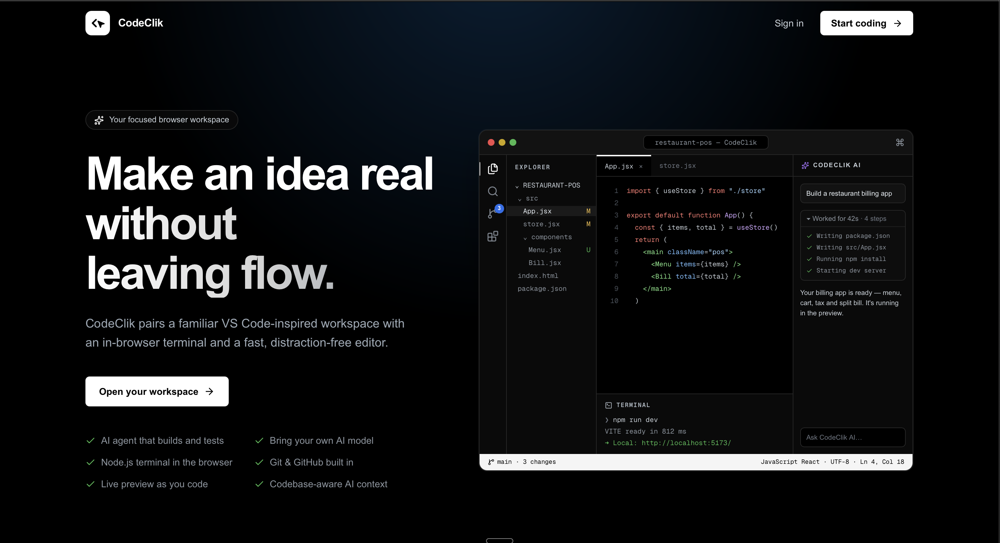
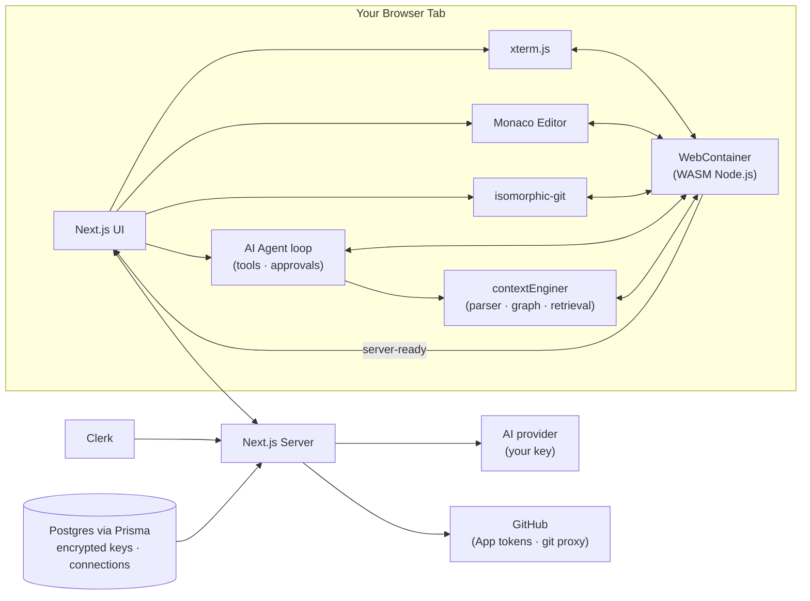

<div align="center">


# CodeClik

### A dev machine that lives in a browser tab.

Editor. Shell. Git. GitHub. An AI agent that builds, runs and checks your app.
No install, no Docker, no `ssh` — just a URL.

<br />

[](https://nextjs.org)
[](https://www.typescriptlang.org)
[](https://webcontainers.io)
[](./LICENSE)

<br />



</div>

---

## The pitch

You open a tab. Seconds later you have a real Node.js environment — file
system, package manager, interactive shell — running entirely **client-side in
WebAssembly**. No server executes your code, no container spins up on someone's
cloud bill.

Then you ask the agent to *"build a restaurant billing app"*, and it writes the
files, installs packages, starts the dev server, reads the errors from the live
preview and fixes them — asking before it runs anything. You commit and push to
GitHub without leaving the tab.

## What's in here

| | |
|---|---|
| 🖊️ **Editor** | Monaco (the VS Code editor) — tabs, unsaved-change dots, save-before-close guard, diff view for any commit |
| 💻 **Terminal** | An interactive shell (`jsh`) inside the WebContainer. Keeps running while you switch panels |
| 🌲 **File Explorer** | Inline new file / new folder / rename / delete, right in the tree — no pop-ups |
| 🔴 **Live Preview** | Opens automatically when a dev server starts; reload and open-in-new-tab |
| 🤖 **AI Agent** | Builds whole apps: reads and writes files, runs `npm`, starts the dev server, checks build and page errors, and fixes them. Works until the task is done (up to 200 steps, with stuck detection and a real Stop button). Shows a collapsible *"Worked for 42s · 9 steps"* log, then the answer |
| 🛡️ **Agent guardrails** | Commands, servers and deletions need your **Allow** in the chat. Commands that can't work in the browser (`bash`, `grep`, `python`, pipes…) are rejected up front with the right alternative. `.git`, `node_modules` and `.env` are off-limits |
| ✦ **Bring your own model** | xAI/Grok, Groq, OpenAI, Anthropic, Gemini, OpenRouter, any OpenAI-compatible endpoint, or local Ollama. Agent mode (tool calling) works with the OpenAI-compatible providers; chat works with all of them. Keys are AES-256-GCM encrypted and only decrypted on the server |
| 🧠 **Context engine** | `contextEnginer/` parses your project with `web-tree-sitter` (symbols, imports, code graph) and retrieves the code relevant to your question — use the **Entire workspace** context mode in the AI panel |
| 🌿 **Git** | Full local git via `isomorphic-git`: stage, commit, branch, merge, tag, remotes, history with diffs. A change-count badge on the Source Control icon, like VS Code. Packages and build output (`node_modules`, `dist`, `.env`…) are never tracked |
| 🐙 **GitHub** | Connect via a GitHub App, clone by URL, fetch / pull / push with short-lived tokens. **Force Push**, and **Push as New Project** to publish cloned code to your own repo |
| ⌘K **Command palette** | Jump to any file or panel without the mouse |
| 🔐 **Auth & data** | Clerk sign-in (the editor requires it), Postgres + Prisma for connections and usage |

**Runs:** HTML/CSS/JS, TypeScript, React, Vite, Next.js, Node/Express and npm
packages. Other languages (Python, Java, Go…) can be edited but not run — the
workspace is Node.js in your browser.

## Architecture



Files, shell and dev server never leave the browser. The server's job is small:
check sign-in, decrypt an AI key for one outbound call, mint short-lived GitHub
tokens, and proxy git traffic (browsers can't call github.com directly).

## Security

- **Editor and every API route require sign-in**; each user only sees their own data.
- **AI keys** are AES-256-GCM encrypted at rest and never sent back to the browser.
- **GitHub connections are verified**: an installation is only linked after GitHub confirms (via OAuth) that the signed-in GitHub user owns it.
- **No SSRF through custom AI endpoints**: user-supplied endpoints must be public `https` addresses — localhost, private networks and cloud metadata are blocked, redirects aren't followed.
- **The git proxy** only talks to GitHub, GitLab and Bitbucket, and only forwards git protocol requests.

## Tech stack

| Layer | Choice |
|---|---|
| Framework | Next.js 16 (App Router) · React 19 · TypeScript 5 |
| Sandbox runtime | [`@webcontainer/api`](https://webcontainers.io) — in-browser Node.js |
| Editor | `@monaco-editor/react` |
| Terminal | `@xterm/xterm` + `@xterm/addon-fit` |
| Version control | `isomorphic-git` + a GitHub App |
| AI | Provider-agnostic chat + a tool-calling agent loop (OpenAI-compatible) |
| Context engine | `contextEnginer/` — `web-tree-sitter`, symbol index, code graph, hybrid retrieval |
| Auth | Clerk |
| Database | PostgreSQL + Prisma |
| Styling | Tailwind CSS v4 · lucide-react |

## Getting started

**Prerequisites:** Node.js 18+, a PostgreSQL database, a [Clerk](https://clerk.com) app, and — for GitHub features — your own [GitHub App](https://docs.github.com/en/apps/creating-github-apps).

```bash
git clone https://github.com/Niket420/CodeClik.git
cd CodeClik
npm install
```

Create `.env.local`:

```bash
NEXT_PUBLIC_CLERK_PUBLISHABLE_KEY=your_clerk_publishable_key
CLERK_SECRET_KEY=your_clerk_secret_key
DATABASE_URL=your_postgres_connection_string

# GitHub App
GITHUB_APP_ID=your_github_app_id
GITHUB_PRIVATE_KEY=your_github_app_private_key
GITHUB_CLIENT_ID=your_github_app_client_id
GITHUB_CLIENT_SECRET=your_github_app_client_secret

# AI key encryption — 32-byte hex (openssl rand -hex 32). Back it up:
# losing it makes every saved AI key unreadable.
AI_ENCRYPTION_KEY=your_32_byte_hex_key
```

Then:

```bash
npx prisma generate
npx prisma migrate deploy
npm run dev
```

Open [http://localhost:3000](http://localhost:3000). You need a browser with
`SharedArrayBuffer` support (recent Chrome, Edge or Firefox) — the app sends its
own cross-origin isolation headers.

### GitHub App settings

In your GitHub App (**Settings → Developer settings → GitHub Apps → Edit**):

- **Permissions:** Contents → *Read and write*
- **Callback URL:** `http://localhost:3000/api/github/callback` (add your deployed domain later)
- ✅ **Request user authorization (OAuth) during installation** — required; connections are verified with it
- Webhook → *Active* off (not used)

Then give the app access to the repositories you want to push to
(**Settings → Applications → Installed GitHub Apps → Configure**).

## Good to know

- **The workspace lives in memory.** Refreshing or closing the tab clears it — push your work to GitHub.
- **Clones are fast (latest commit only).** To push cloned code to a *different* repository, use **⋯ → Push as New Project** once; normal pushes work after that.
- **The clone box works for public repositories.**

## Keyboard shortcuts

| Shortcut | Does |
|---|---|
| `⌘K` / `Ctrl+K` | Command palette — jump to a file or panel |
| `⌘S` / `Ctrl+S` | Save the active file |
| `⌘⏎` / `Ctrl+⏎` | Commit staged changes (in the commit message box) |
| `⇧⏎` | New line in the AI chat (plain `⏎` sends) |

## Project structure

```
my-app/
├── app/
│   ├── page.tsx                  # Landing page
│   ├── playground/               # The IDE (sign-in required)
│   └── api/
│       ├── ai/                   # Provider config + chat proxy
│       ├── github/               # Install, OAuth callback, tokens, repos
│       └── git-proxy/            # Proxies git traffic to GitHub/GitLab/Bitbucket
├── agents/                       # The AI agent
│   ├── core/                     # Agent + loop (steps, stop, stuck detection)
│   ├── tools/                    # read/write/list/delete, run_command, dev server
│   ├── executor/                 # Approvals + guardrails
│   ├── runtime/                  # Long-running dev server + preview errors
│   └── prompts/                  # System prompt
├── components/
│   ├── ide/                      # Editor, Explorer, Terminal, Preview, Git, AI panel
│   └── brand/                    # Logo
├── lib/
│   ├── webcontainer.ts           # WebContainer boot
│   ├── git.ts  git-fs.ts         # isomorphic-git + WebContainer FS bridge
│   ├── github.ts                 # GitHub App tokens + OAuth verification
│   ├── encryption.ts             # AES-256-GCM for stored API keys
│   └── ai/                       # Rate limits, endpoint safety checks
├── contextEnginer/                # Code-intelligence package (parser, graph, retrieval)
└── prisma/
    └── schema.prisma
```

## Roadmap

- [ ] Save workspaces so a refresh doesn't clear them
- [ ] Agent mode (tool calling) for Anthropic and Gemini
- [ ] Clone private repositories by URL
- [ ] Deploy (Cloudflare)

## Contributing

Issues and PRs welcome. This moves fast and occasionally breaks — that's the
deal with building in public.

## License

[MIT](./LICENSE)
